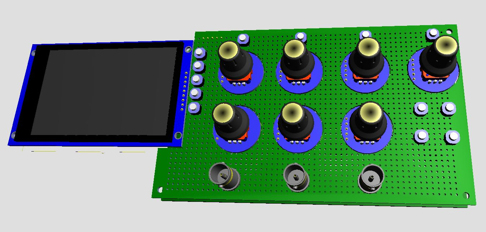

# Tiny_DSO_V2: 65MSPS Digital Storage Oscilloscope

Un oscilloscopio digitale ad alte prestazioni basato su architettura eterogenea **FPGA (Intel Cyclone IV)** e **Soft-Processor AVR**. Progettato per l'acquisizione di segnali in tempo reale con risoluzione a 12 bit.

  

## 🚀 Caratteristiche Principali
- **Sampling Rate:** 65 MSPS (Real-time) tramite ADC parallelo.
- **Risoluzione:** 12 bit (AD9226).
- **Core CPU:** AVR V8 Soft-Core sintetizzato @ 60 MHz.
- **Trigger Engine:** Unità hardware dedicata con latenza di 15.4ns.
- **Display:** Supporto per controller ST7789 tramite SPI hardware ottimizzata.
- **Toolchain:** Compilato con l'ultima versione di AVR-GCC (15.1).

## 🛠️ Architettura del Sistema
Il progetto si divide in due componenti principali che lavorano in sinergia:

### 1. Hardware (VHDL/Verilog)
La logica programmabile gestisce le operazioni "time-critical":
- **ADC Controller:** Interfaccia parallela per l'AD9226 che cattura 12 bit per ciclo di clock.
- **Trigger System:** Monitoraggio continuo della soglia e gestione delle modalità `trigger_source`, `trigger_slope` e `trigger_mode`.
- **Memory Buffer:** Implementazione di buffer circolari in Block RAM per evitare la perdita di campioni durante la lettura della CPU.

### 2. Firmware (C)
Il software gestisce l'intelligenza dello strumento:
- **Rendering Differenziale:** Algoritmo ottimizzato per aggiornare solo i pixel necessari della traccia, riducendo il carico sul bus del display.
- **Interfaccia Utente:** Gestione degli input per la regolazione di scale temporali, offset e parametri di trigger.

## 📦 Requisiti di Sviluppo
- **FPGA:** Intel/Altera Cyclone IV (es. EP4CE22).
- **IDE:** Quartus Prime (per la sintesi hardware).
- **Toolchain:** AVR-GCC 15.1 o superiore (per il firmware).
- **Hardware ADC:** Modulo AD9226 (12-bit, 65MSPS).

---
*Developed by MJE - 2026*